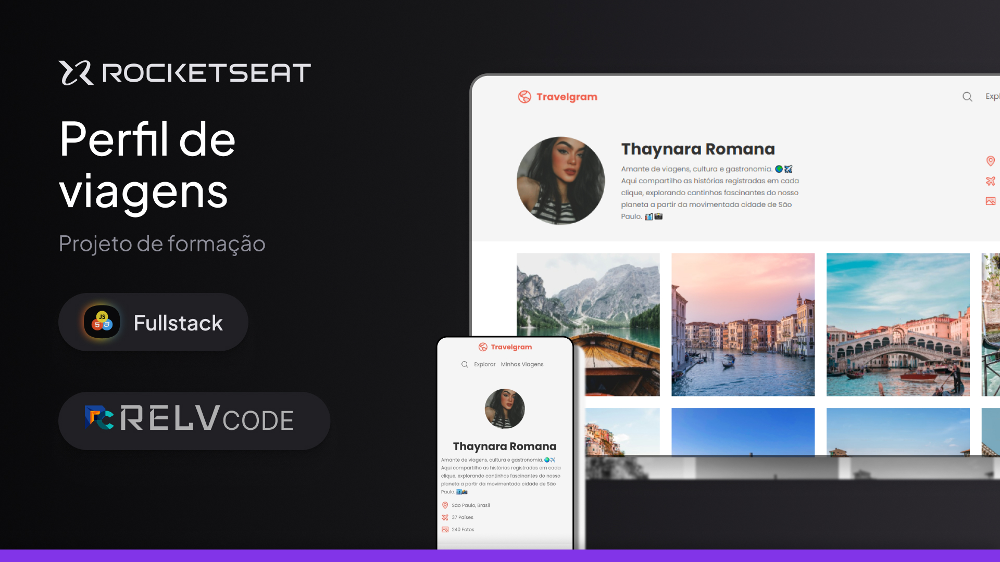
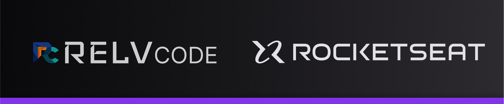

# 📸 Travelgram — Rocketseat Discover

Projeto desenvolvido no módulo **"Avançando no HTML e CSS"** do curso Discover da Rocketseat. O objetivo é criar um layout de perfil de viagens inspirado em redes sociais, praticando conceitos avançados de HTML e CSS, com foco em organização, responsividade e boas práticas de código.

## 🗂 Sobre o Código

O projeto é composto por uma página estática (`index.html`) com estilização modularizada em múltiplos arquivos CSS, seguindo a estrutura:
- **global.css**: configurações globais (cores, fontes, resets)
- **nav.css**: estilização da navegação (menu)
- **bio.css**: layout do perfil (foto, nome, descrição, informações)
- **footer.css**: rodapé do site
- **index.css**: arquivo principal que importa os estilos acima
- **responsivo.css**: regras de responsividade para ajustar o layout em diferentes tamanhos de tela.

O HTML foi estruturado com semântica e boas práticas, e o CSS foi separado para garantir **organização e reusabilidade**.

## 🖥 Tecnologias Utilizadas
- HTML5 (semântico)
- CSS3 (modularizado e responsivo)
- Google Fonts (Poppins)
- Figma (para design de referência)

## 📚 O que foi aprendido no Curso
Durante o módulo "Avançando no HTML e CSS" da Rocketseat, foram abordados:
- Estruturação de páginas com HTML semântico.
- Modularização de CSS em arquivos específicos.
- Uso de **variáveis CSS** para cores e tipografia.
- Conceitos de **responsividade com Media Queries**.
- Técnicas de **centralização, alinhamento com Flexbox**.
- Remover comportamentos nativos indesejados em mobile (tap highlight).
- Boas práticas de organização de arquivos e pastas no projeto.
- Como transformar um design (Figma) em código com fidelidade visual.

## 🚀 Como rodar o projeto
1. Clone o repositório:
   ```bash
   git clone https://github.com/seu-usuario/travelgram.git
   ```
2. Acesse a pasta do projeto:
   ```bash
   cd travelgram
   ```
3. Abra o arquivo `index.html` no seu navegador.

## 📷 Preview
(Coloque aqui uma imagem ou GIF mostrando o site funcionando)

## 📝 Créditos
Projeto feito como desafio do curso **Discover - Rocketseat**.  
Código por [Seu Nome].  
Layout original do módulo "Travelgram" Rocketseat.




---
